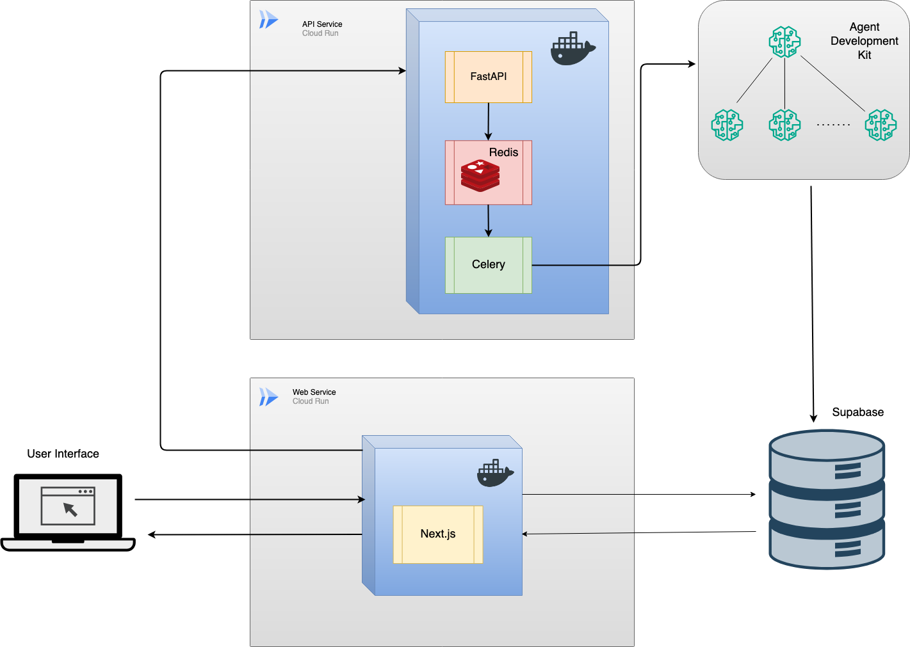

# AI Course Builder

The repo contains an intelligent course generation platform built as part of the 2025 [Devpost Agent Development Kit Hackathon with Google Cloud](https://googlecloudmultiagents.devpost.com/) within a limited 48 hour time window. This application leverages AI agents to automatically create comprehensive educational courses based on user-provided topics and study criteria.

## Architecture Overview



## Technology Stack

### Frontend
- **Next.js**: Modern React framework used to build the responsive frontend application
- **TypeScript**: For type-safe development
- **CSS Modules**: For component-scoped styling

### Backend & Database
- **Supabase**: Provides PostgreSQL database and authentication services
- **PostgreSQL**: Primary database for storing course data, user information, and application state
- **Row Level Security (RLS)**: Implemented across all database tables to ensure users can only access their own data

### API & Task Processing
- **FastAPI**: Python-based API server providing the `/api/v1/create-course` endpoint
- **Celery**: Distributed task queue for handling long-running course generation tasks
- **Redis**: Message broker for Celery task distribution and state management

### AI & Agents
- **Google Cloud Agent Development Kit**: Powers the intelligent course generation system
- **Web Search Agents**: Automatically research topics and construct comprehensive course overviews
- **Content Generation Agents**: Create detailed section content based on course instructions

## How It Works

### Course Creation Flow

1. **User Input**: Users provide a course topic and study criteria through the Next.js frontend
2. **API Request**: The frontend sends a request to the FastAPI server's `/api/v1/create-course` endpoint
3. **Task Queuing**: The API server uses Celery to queue the course generation as a background task
4. **Course Overview Generation**: 
   - An AI agent searches the web to research the topic
   - Constructs a robust course overview with detailed section instructions
   - Updates the database with the course overview and section instructions
5. **Parallel Section Generation**: 
   - Multiple agents work in parallel to write content for each section
   - Each agent receives specific instructions for their assigned section
6. **Real-time Updates**: The Next.js frontend directly queries Supabase to display course content as it's generated

### Data Flow

- **Frontend ↔ Supabase**: Direct communication for user authentication, course data retrieval, and real-time content updates
- **Frontend ↔ API Server**: Communication for course creation requests and status updates
- **API Server ↔ Redis**: Task distribution and state management
- **Celery Workers ↔ Supabase**: Database updates via `on_after_agent` callbacks

### Security

- **Bearer Token Authentication**: The backend API validates Bearer headers for authorized access
- **Row Level Security**: Database-level security ensuring users can only access their own courses and data
- **Supabase Auth**: Handles user registration, login, and session management

## Deployment

### Current Architecture (48-hour hackathon constraints)

- **API Service Container**: Single container on Google Cloud Run containing:
  - FastAPI server
  - Redis broker
  - Celery worker processes
- **Frontend Container**: Next.js application deployed on Google Cloud Run

### Future Improvements (with more development time)

- **Microservices Architecture**: Separate containers for API server, Redis, and Celery workers
- **Horizontal Scaling**: Independent scaling of each service component
- **Virtual Private Cloud (VPC)**: Secure network isolation for frontend and backend services
- **Load Balancing**: Distributed traffic across multiple service instances

## Project Structure

```
├── web/                 # Next.js frontend application
└── server/              # FastAPI backend and Celery workers
```
